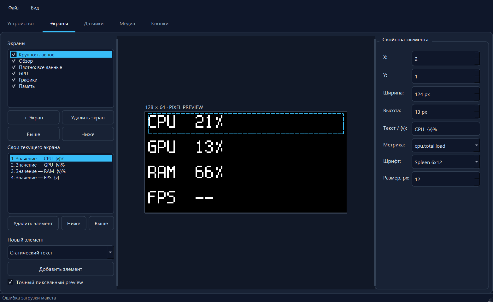

# Trezor PC Monitor

[](https://github.com/AbdulKus/trezor_PC_monitor/actions/workflows/ci.yml)
[](https://github.com/AbdulKus/trezor_PC_monitor/releases)
[](LICENSE.md)

Turn a dedicated **Trezor One (T1B1)** into a compact 128×64 OLED system monitor. The Windows editor builds pixel-perfect screens, streams live telemetry over USB HID, and maps the two hardware buttons to pages or PC actions.

> [!CAUTION]
> This is unofficial community firmware, not a wallet application. Installing unofficial firmware can erase the device storage. Use a dedicated Trezor One and make sure your recovery seed is safely backed up before flashing.



## What it does

- WYSIWYG 128×64 editor with an exact 1-bit device preview.
- Sparkline graphs keep zero at the baseline and smoothly adapt their upper bound with headroom and visible scale-change markers.
- FPS graphs use stable 30/60/90/120/144/165/180/200/240/300/360/480 presets and require about 10 seconds of evidence before switching, so short drops remain visible valleys.
- Text, images, animated GIFs, bars, segmented gauges, rings, sparklines, icons, lines and threshold warnings.
- Seven ready-made layouts ranging from compact dashboards to large, readable single-metric pages.
- CPU, RAM, GPU, VRAM, FPS/frame-time and supported temperature/power metrics.
- PresentMon integration for foreground-game FPS, with automatic discovery of the bundled or installed SDK loader; unavailable readings stay `N/A` instead of becoming fake zeroes.
- Media is resized and converted on the PC to its final 1-bit dimensions. Only media used on enabled pages is uploaded.
- Short/long button actions, local page switching, shortcuts and commands.
- Tray operation, reconnect recovery and automatic layout re-upload after power loss.
- A global single-instance guard prevents two portable copies from fighting over the same HID device.
- Russian and English UI, remembered together with the selected Dark/Light/Forest theme.
- Optional OLED burn-in protection reserves a configurable safe border and moves the rendered image clockwise every two minutes.
- The last opened `.tmon` project is restored automatically on the next launch.
- Built-in firmware wizard and a standalone firmware build path pinned to a known Trezor upstream revision.

## Install

1. Download the latest `Trezor-PC-Monitor-*-win64.zip` from [Releases](https://github.com/AbdulKus/trezor_PC_monitor/releases).
2. Extract it to a writable folder and run `TrezorPcMonitor.exe`.
3. Open **Device → Firmware wizard**, put a Trezor One into bootloader mode and follow the on-screen confirmation. The application never confirms the device prompt for you.
4. If you need game FPS, run the bundled PresentMon installer once. Normal monitoring does not require administrator rights afterward.
5. Choose or edit a page, connect the device and press **Send to device**.

Portable settings and logs are stored next to the executable in `portable-data`. CPU/GPU temperature and power depend on hardware and driver support; unsupported values are shown as `N/A`.

## Build the Windows application

Requirements: Windows 10/11 x64, Visual Studio 2022 or MinGW, CMake 3.24+, Ninja, and Qt 6.8+ with Widgets.

```powershell
git clone https://github.com/AbdulKus/trezor_PC_monitor.git
cd trezor_PC_monitor
powershell -ExecutionPolicy Bypass -File scripts/build-windows.ps1 -QtDir C:\Qt\6.8.3\msvc2022_64
powershell -ExecutionPolicy Bypass -File scripts/package-portable.ps1 -QtDir C:\Qt\6.8.3\msvc2022_64
```

The application is written in C++20. Full prerequisites, MinGW examples and packaging instructions are in [docs/BUILDING.md](docs/BUILDING.md).

## Build the firmware

The reproducible firmware helper clones the pinned upstream Trezor tree, overlays this repository's firmware and protocol sources, then builds both the internal `TRZF` image and the signed `TRZR` archive container:

```bash
./scripts/build-firmware.sh
```

Linux with Git and Nix is recommended. Outputs are placed in `artifacts/firmware`. See [docs/FIRMWARE.md](docs/FIRMWARE.md) before flashing.

## Repository map

```text
app/                 Qt editor, telemetry and device transport
firmware/            Trezor One renderer and prebuilt firmware images
protocol/            Shared 64-byte HID protocol implementation
assets/screenshots/  Documentation images
docs/                User, build, firmware and protocol guides
scripts/             Local build and portable packaging helpers
.github/workflows/   Windows CI, release packaging and firmware build
```

## Documentation

- [Руководство пользователя на русском](docs/README_RU.md)
- [Building and packaging](docs/BUILDING.md)
- [Firmware and flashing safety](docs/FIRMWARE.md)
- [HID protocol](docs/PROTOCOL.md)
- [Architecture](docs/ARCHITECTURE.md)
- [Contributing](CONTRIBUTING.md)
- [Security policy](SECURITY.md)
- [Third-party notices](THIRD_PARTY_NOTICES.md)

## Project status

The project is usable, but it is still an early community release. Test firmware on a dedicated device. Hardware sensors vary greatly between PCs, and the application deliberately reports unsupported telemetry as unavailable.

Trezor is a trademark of SatoshiLabs. This project is not affiliated with or endorsed by SatoshiLabs.
